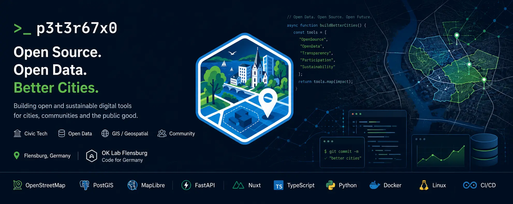

  

# p3t3r67x0

### Open Source · Civic Tech · Open Data · GIS · Geospatial Engineering

**Building open digital infrastructure for cities, communities and public data.**

---

## 👋 About

I build **open-source geospatial and civic-tech software** that makes public and spatial data easier to access, understand, explore and reuse.

My work focuses on **Open Data, GIS, OpenStreetMap, web mapping and open digital infrastructure**. I am especially interested in turning complex municipal and geospatial datasets into useful, accessible applications for cities and communities.

## 🚀 Flagship project — Open City Planner

**Open City Planner** is a modular, open-source **Web GIS for urban planning, spatial analysis and open geodata**.

It combines interactive maps with tools for working with areas, spatial information and OpenStreetMap data. The architecture is being developed around reusable modules so functionality can be extended for different regions and civic-tech use cases.

| | |
|---|---|
| 🌍 **Live application** | [stadtplaner.oklabflensburg.de](https://stadtplaner.oklabflensburg.de) |
| 💻 **Source code** | [oklabflensburg/open-city-planner](https://github.com/oklabflensburg/open-city-planner) |
| 🧩 **Focus** | Modular Web GIS, spatial analysis, Open Data, reusable civic-tech modules |
| 🗺️ **Geospatial** | OpenStreetMap, PostGIS, MapLibre, vector tiles |

## 🏙️ Civic Tech & Open Data

I contribute to **[OK Lab Flensburg](https://oklabflensburg.de)** and the **Code for Germany** civic-tech ecosystem.

Our work explores how open source and open data can create useful public digital infrastructure, including:

- 🗺️ Web GIS and interactive mapping
- 🌐 OpenStreetMap and geospatial data
- 🏛️ municipal and public Open Data
- 🌱 environmental and biotope data
- 🏘️ urban planning and spatial analysis
- 🏺 cultural heritage and monument data
- ⚡ energy and infrastructure data
- 🧭 tools for discovering, understanding and reusing public information

➡️ **Explore the projects:** [github.com/oklabflensburg](https://github.com/oklabflensburg)

## 🛠️ Technology stack

### Geospatial

### Backend & data

### Frontend

### Infrastructure

## 💡 Areas of interest

`Civic Tech` · `Open Data` · `Open Government Data` · `GIS` · `Web GIS` · `Geospatial` · `OpenStreetMap` · `Urban Planning` · `Spatial Analysis` · `Digital Public Infrastructure`

I believe useful public digital infrastructure should be **open, transparent, interoperable and reusable**.

## 🤝 Collaboration

I'm interested in collaborating on **open-source GIS, web mapping, civic-tech software, OpenStreetMap tooling, Open Data infrastructure and reusable digital tools for cities and communities**.

If you're working in this space, feel free to connect through GitHub.

---

**Open Source for open cities.** 🌍

